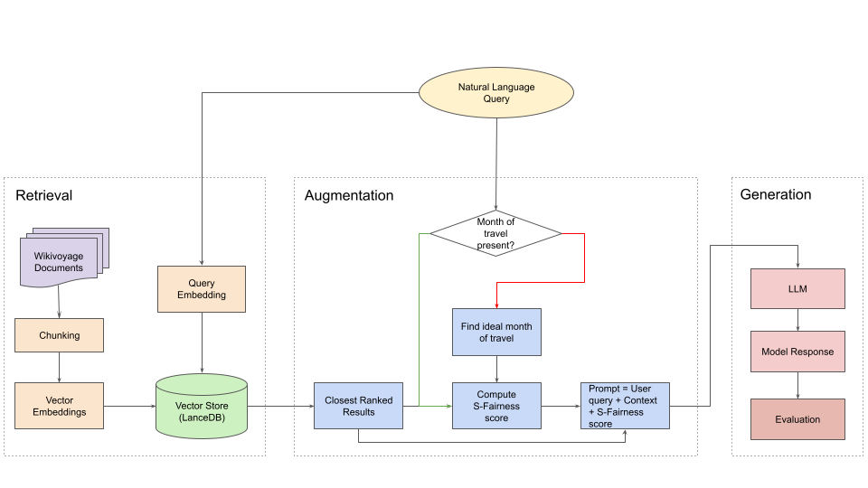

# Enhancing Tourism Recommender Systems for Sustainable City Trips Using Retrieval-Augmented Generation

In this project, we use RAGs to enhance the recommendation capability of LLMs by curating a knowledge base of tourism information for European cities, along with relevant sustainability information. 



## Technical Details

- Data source: Wikivoyage Dumps
- Knowledge Base and Query Embedding Model: all-MiniLM-L6-v2
- VectorDB: LanceDB (needs to be set up before the pipeline can be run)
- LLMs already included: Llama3-8B, Mistral-7B, Llama3.1.-8B, Llama3-Instruct-8B, Mistral-Instruct-7B, Llama3.1-Instruct-8B, Phi3-Small-Instruct, GPT-4o-mini (other LLMs can also be used, provided they are initialized in `src.text_generation.model_init.py`)

## Steps to run the code locally

### Directory Structure
```
|-- README.md
|-- database
|-- european-city-data
|-- requirements.txt
|-- src
|   |-- __init__.py
|   |-- augmentation
|   |   |-- __init__.py
|   |   |-- prompt_generation.py
|   |-- data_directories.py
|   |-- information_retrieval
|   |   |-- __init__.py
|   |   |-- info_retrieval.py
|   |-- pipeline.py
|   |-- sustainability
|   |   |-- __init__.py
|   |   |-- s_fairness.py
|   |-- text_generation
|   |   |-- __init__.py
|   |   |-- llm_test.ipynb
|   |   |-- model_init.py
|   |   |-- text_generation.py
|   |-- vectordb
|       |-- __init__.py
|       |-- create_db.py
|       |-- helpers.py
|       |-- lancedb_init.py
|       |-- vectordb.py
|-- tests
```

### Set Up
1. Set up a [virtual environment](https://docs.python.org/3/library/venv.html) and install the required libraries: 
        
        pip install -r requirements.txt

2. [Install huggingface_hub](https://huggingface.co/docs/huggingface_hub/en/installation) and log in: 
        
        huggingface-cli login

3. Request access to the models on HuggingFace
4. Clone the [dataset](https://huggingface.co/datasets/RecSysTUM/european-city-data) and ensure that the directory structure is maintained - the DB creation and retrieval will fail if the paths do not match
5. In order to set up the local database, navigate to the `src` directory and run: 

        python3 -m vectordb.create_db 
    
    This will automatically create the database under the right directory. 

This completes the set up! To execute the pipeline for a sample query, run the following command in the `src` directory:

    python3 pipeline.py


### Points to remember during project setup
- the vector `database` is created under `sustainable-trs-with-rag/database/`
- the data from HF repo is stored under `sustainable-trs-with-rag/european-city-data/`
- To run the single pipeline from the command line, use the following command:
```python pipeline.py``` from the `src` directory.
- If you are using an IDE e.g. Pycharm, you can run the `pipeline.py` file directly by making sure you set the src directory as your `"Sources Root"`.
